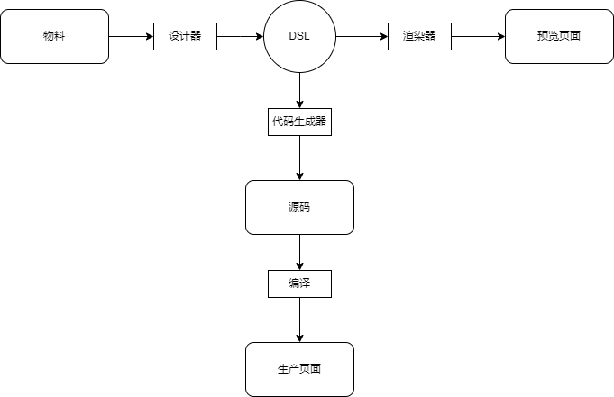
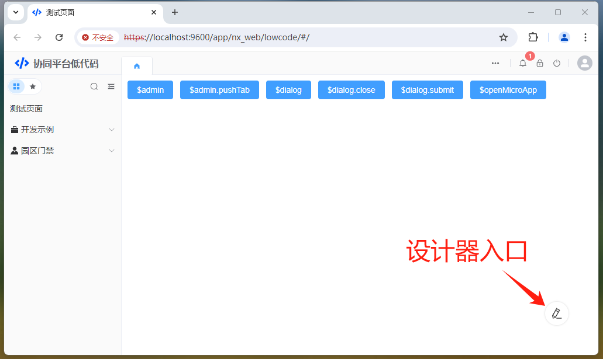
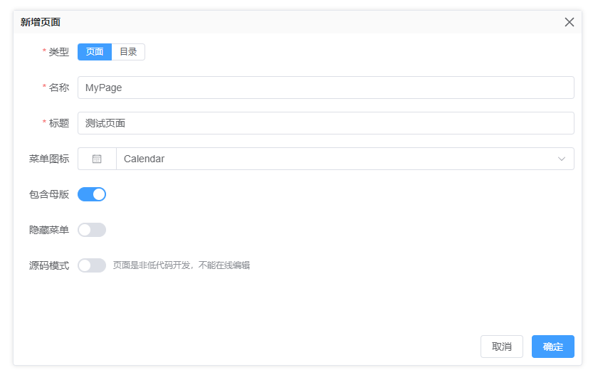
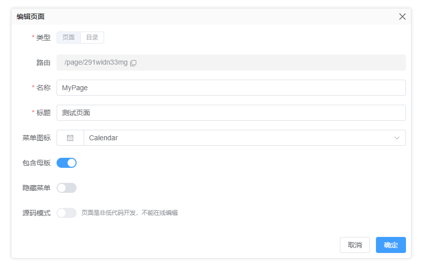

# 设计器操作手册

VTJ. 是以协议驱动的低代码引擎。本章介绍低代码设计器的操作说明。

## 概况

### 相关概念

为了更好描述低代码的工作过程，需要了解以下概念。

- **协议**
  —— 指低代码开发平台组件、页面的描述约定。

- **DSL**
  —— 领域特定语言，指根据协议对低代码页面的描述，是JSON格式的数据。

- **页面**
  —— 指使用设计器创建的vue单文件组件，带有路由，发布后可通过路由 `/page/页面ID` 访问。

- **区块**
  —— 指使用设计器创建可复用的vue单文件组件，不包含路由，可被页面或其他区块引用。

- **物料**
  —— 指带有低代码协议描述的vue组件

### 工作数据流

设计器的作用是通过可视化的方式把低代码物料生成DSL。

### 入口链接

启动低代码开发环境，在页面的右下角右编辑的图标，点击可进入到设计器并打开当前页面的设计模式

### 功能分区

低代码设计器采用骨架分区的方式构建，功能有以下区域， 没个区域下内置了响应的功能组件`Widget`

- **品牌区：** 包含品牌Logo、显示当前打开的项目和正在编辑组件，点击链接可返回当前页面组件的源码预览模式。
- **工具区：** 模拟器视图切换、当前编辑文件的操作历史记录导航。
- **操作区：** 文件预览、页面刷新、页面设置、发布。
- **应用区：** 页面管理、区块管理、物料组件库、当前编辑的页面大纲树结构、当前文件编辑历史记录、API管理、数据配置管理、依赖管理、项目配置。
- **工作区：** 当前文件的设计视图、DSL视图、源码视图、帮助文档、物料市场。
- **设置区：** 页面设置（状态数据、计算属性、组件方法、生命周期、watch、css、数据源、组件定义），节点设置（属性、样式、事件、指令）。
- **状态区：** 当前正在设置的节点信息、错误报告。

## 页面管理

页面管理是低代码的基础功能，在这里可以创建页面或目录。可以组成树数据结构，页面树数据就是系统的菜单数据。

